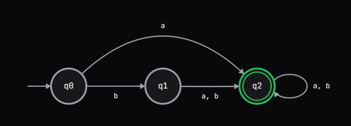
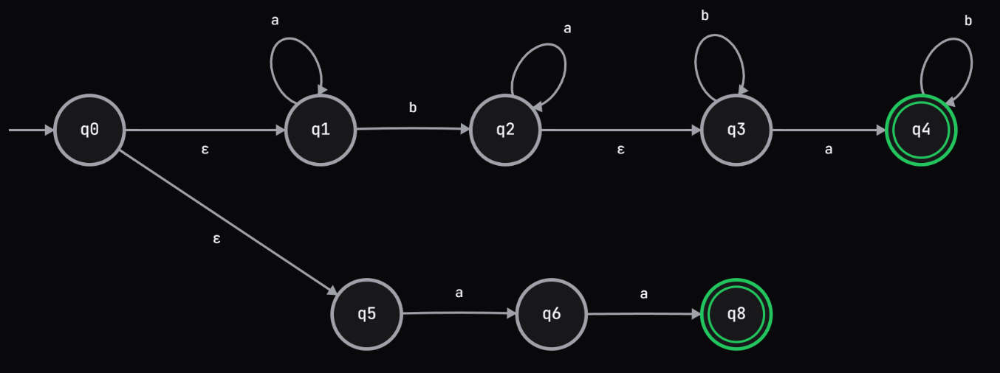

# Computational Theory Project
Owner: Duc Anh (Jeremy) Duong

## How to run:
1. Install python
2. Run `python main.py` from the project root

## Content:

### DFA:

#### Definition:

```
Given the alphabet {a, b}, language L1 accepts all strings that splits into a prefix with an even number of a's, followed by either an exact string "bb" OR any string starting with "a".
```

#### Formal:

```
Let Σ  = {a, b}
L1 = { xy | x ∈ Σ* and #a in x is even, and y = ({"bb"} ∪ {aw | w ∈ Σ*}) }
```

#### State diagram:


### NFA:

#### Definition:
```
Given the alphabet {a, b}, L2 accepts all strings over {a, b} that are either (1) a concatenation of a string with exactly one 'b' and a string with exactly one 'a', OR (2) the exact string "aa"
```

#### Formal:

```
Let Σ  = {a, b}
L2​= { xy ∪ w ∣ x ∈ Σ* has exactly one b, y ∈ Σ* has exactly one a, w="aa" }
```

#### State diagram:
